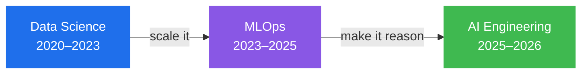

<h1 align="center"><code>nasserboan</code> — deployed to production since 2015</h1>

<p align="center">
  
</p>

<p align="center">
  
  
  
  
</p>

> I build systems that reason over data and survive contact with production.
> Started in models, moved to infrastructure, ended up teaching machines to think —
> and I still reach for a parser before I reach for an LLM.

---

## `pipeline.dag` — how I got here



**Data Science** taught me rigor — temporal splits, skew, the difference between a good metric and a lucky one. The model, it turned out, was 10% of the job; the pipeline was the rest. **MLOps** taught me to own that rest — the plumbing that feeds, monitors, and retrains a model long after training. **AI Engineering** taught me restraint: language models rewrote the rulebook, but an LLM is a tool, not a default — so I stopped reaching for one when a deterministic path will do.

---

## `self.yaml`

```yaml
service:
  name: nasserboan
  role: Senior ML / AI Engineer
  location: Brasília, Brazil 🇧🇷
  github_since: 2015
  ships_to_prod: true

capabilities:
  - LLMs, agents & Retrieval-Augmented Generation
  - Data lineage & metadata extraction
  - MLOps — Kubernetes, ArgoCD, GitOps, experiment tracking
  - End-to-end ML — feature engineering → serving
  - Community — talks & teaching

stack:
  languages:     [Python, SQL, Bash]
  ai_llm:        [LangChain, CrewAI, Ollama, OpenAI, ChromaDB, docling, MCP]
  ml:            [LightGBM, PyTorch, TensorFlow, scikit-learn, Optuna]
  serving:       [FastAPI, MongoDB, uv, Docker]
  orchestration: [Kubernetes, Minikube, ArgoCD, MLflow, Metaflow]
  frontend:      [React, Vite, Next.js]

contact:
  linkedin: nsboan

party_trick: can bend his own ear   # load-bearing personality trait
```

---

## `observability/`

```yaml
talks_and_teaching:
  - PyData Brasília — MLflow for experiment tracking
  - Banco do Brasil — RAG systems in production
  - Ministério da Infraestrutura — taught Python
also_running:
  - a homelab that is somehow always on fire and always up
```

---

## `contact/`

<p align="center">
  <a href="https://www.linkedin.com/in/nsboan/"></a>
  <a href="https://github.com/nasserboan"></a>
</p>

<p align="center"><sub><code>$ uptime</code> → deployed since 2015 · no critical incidents · ship it 🚀</sub></p>
